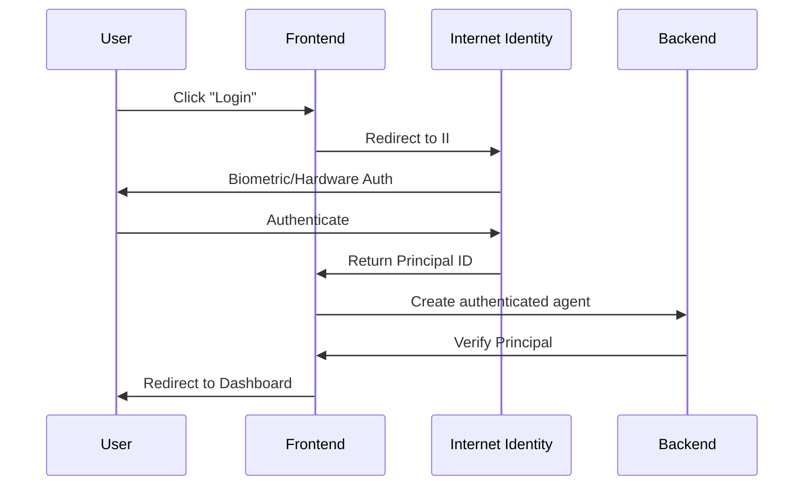

# ATOS-fit Complete Documentation

## 🎯 Overview

ATOS-fit is a comprehensive fitness application built on the Internet Computer with Internet Identity authentication and a Motoko backend canister for secure, decentralized data storage.

## 🏗️ Architecture

```
┌─────────────────┐    ┌──────────────────┐    ┌─────────────────┐
│   React Frontend │    │ Internet Identity │    │ Backend Canister │
│                 │    │                  │    │                 │
│ - Login UI      │◄──►│ - Authentication │    │ - User Profiles │
│ - Dashboard     │    │ - Principal ID   │    │ - Workouts      │
│ - User Profile  │    │ - Biometrics     │    │ - Achievements  │
└─────────────────┘    └──────────────────┘    └─────────────────┘
         │                        │                        │
         └────────────────────────┼────────────────────────┘
                                  │
                         ┌─────────────────┐
                         │ Internet Computer│
                         │    Network      │
                         └─────────────────┘
```

## 🚀 Quick Start

### Prerequisites
- Node.js 18+ installed
- DFX (Internet Computer SDK) installed
- WSL2 (for Windows users)

### Setup Commands
```bash
# Install dependencies
npm install

# Setup local IC environment
npm run setup:local

# Start development server
npm run dev
```

### Access URLs
- **Frontend**: http://localhost:8000/?canisterId=[frontend-id]
- **Internet Identity**: http://localhost:8000/?canisterId=[ii-id]
- **Backend Candid UI**: http://localhost:8000/_/candid?canisterId=[backend-id]

## 🔐 Authentication System

### Internet Identity Integration
- **Biometric Authentication**: Fingerprint, Face ID, hardware keys
- **Principal-based Identity**: Unique cryptographic identity per user
- **Decentralized**: No passwords or centralized user database
- **Cross-platform**: Works on all devices with WebAuthn support

### Authentication Flow


## 🗄️ Database Schema

### User Profile (Simplified Structure)
```motoko
public type UserProfile = {
  id: UserId;
  fullName: Text;           // Required
  email: ?Text;             // Optional
  age: Nat;                 // 13-100
  height: Float;            // 100-250 cm
  weight: Float;            // 30-200 kg
  gender: Text;             // "Male", "Female", "Other"
  activityLevel: Text;      // Activity level selection
  primaryGoals: [Text];     // Multiple fitness goals
  preferredWorkoutTime: Text; // Time preference
  workoutReminders: Bool;   // Notification toggle
  createdAt: Time.Time;
  updatedAt: Time.Time;
};
```

### Enhanced Statistics System
```motoko
public type UserStatistics = {
  userId: UserId;
  totalWorkouts: Nat;
  totalDuration: Nat;
  totalCaloriesBurned: Float;
  currentStreak: Nat;
  longestStreak: Nat;
  favoriteExercise: ?Text;
  averageWorkoutDuration: Float;
  weeklyAverage: Float;
  lastWorkoutDate: ?Time.Time;
  // UI-aligned fields
  thisWeekWorkouts: Nat;
  thisMonthWorkouts: Nat;
  weeklyCaloriesBurned: Float;
  monthlyCaloriesBurned: Float;
  weeklyWorkoutGoal: Nat;      // Default: 5
  weeklyCalorieGoal: Float;    // Default: 2000
};
```

### Exercise-Specific Achievement System
```motoko
public type ExerciseAchievement = {
  id: Text;
  exerciseName: Text;          // "Push-ups", "Squats", etc.
  category: Text;              // "Push-Up Challenges", etc.
  levels: [AchievementLevel];  // 5 progressive levels
  createdAt: Time.Time;
};

public type AchievementLevel = {
  level: Nat;              // 1-5
  name: Text;              // "Level 1", "Level 2"
  description: Text;       // "Complete 50 push-ups in one week"
  target: Nat;             // 50, 100, 250, 500, 1000
  timeframe: Text;         // "week", "month", "all_time"
  points: Nat;
  icon: Text;
};

public type UserExerciseProgress = {
  id: Text;
  userId: UserId;
  exerciseName: Text;
  currentLevel: Nat;       // 0 = not started, 1-5 = levels
  weeklyCount: Nat;        // Auto-resets weekly
  monthlyCount: Nat;       // Auto-resets monthly
  allTimeCount: Nat;       // Lifetime total
  lastUpdated: Time.Time;
  unlockedLevels: [Nat];   // Achievement levels unlocked
};
```

### Workout Data Structure
```motoko
public type WorkoutRecord = {
  id: Text;
  userId: UserId;
  workoutData: WorkoutJSON;
  duration: Nat;           // in seconds
  caloriesBurned: Float;   // Calculated by frontend
  averageHeartRate: ?Nat;
  createdAt: Time.Time;
};

public type WorkoutJSON = {
  workoutName: Text;
  exercises: [ExerciseData];
  overallFormScore: Float; // 0-100 (AI analysis)
  completionRate: Float;   // percentage completed
};

public type ExerciseData = {
  name: Text;
  plannedReps: Nat;
  completedReps: Nat;      // Used for achievement tracking
  sets: Nat;
  formErrors: [FormError];
  restTime: Nat;
  notes: ?Text;
};
```

### Food Analysis Integration
```motoko
public type FoodAnalysis = {
  id: Text;
  userId: UserId;
  foodData: FoodJSON;
  mealType: Text;          // breakfast, lunch, dinner, snack
  createdAt: Time.Time;
};

public type FoodJSON = {
  items: [FoodItem];
  totalCalories: Float;    // Calculated by AI scanner
  totalProtein: Float;
  totalCarbs: Float;
  totalFat: Float;
  totalFiber: Float;
  imageUrl: ?Text;
};
```

## 🎮 Achievement Categories

### 1. Push-Up Challenges
- **Push-ups**: Standard push-ups
- **Wide Push-ups**: Chest-focused variation
- **Narrow Push-ups**: Tricep-focused variation
- **Diamond Push-ups**: Advanced tricep variation
- **Knee Push-ups**: Beginner-friendly modification

### 2. Cardio Challenges
- **Jumping Jacks**: Full-body cardio
- **Burpees**: High-intensity compound movement
- **High Knees**: Running in place variation

### 3. Lower Body Challenges
- **Squats**: Fundamental leg exercise
- **Lunges**: Single-leg strength builder
- **Wall Sit**: Isometric leg endurance

### 4. Plank & Core Challenges
- **Knee Plank**: Beginner core exercise
- **Plank**: Standard core hold
- **Side Plank**: Lateral core strength
- **Reverse Plank**: Posterior chain activation
- **Sit-ups**: Traditional core exercise
- **Straight Arm Plank**: Advanced plank variation
- **Straight Arm Reverse Plank**: Advanced posterior exercise

### Achievement Progression
Each exercise has 5 levels with increasing weekly targets:
- **Level 1**: 50 reps/week (10 points)
- **Level 2**: 100 reps/week (20 points)
- **Level 3**: 250 reps/week (50 points)
- **Level 4**: 500 reps/week (100 points)
- **Level 5**: 1000 reps/week (200 points)

## 📱 UI Components & Data Flow

### Dashboard Statistics
- **Weekly Progress**: Workouts 0/5, Calories 0/2000
- **Performance Overview**: This Week/Month workouts, Avg Duration, Current Streak
- **Achievement Badges**: Progress tracking with earned/total display
- **Exercise Achievements**: Level-based progression system

### Data Sources
1. **Profile Data**: `useUserProfile()` hook
2. **Statistics**: `useUserStatistics()` hook (enhanced)
3. **Achievements**: `useAchievements()` hook (enhanced)
4. **Exercise Progress**: Exercise-specific achievement tracking

### Calculated Fields (Frontend Logic)
- Calories from food scanner (AI analysis)
- Form scores from workout analysis
- Progress percentages for achievements
- Weekly/monthly progress bars

## 🔧 Project Structure

```
src/
├── backend/
│   ├── main.mo              # Main canister logic
│   └── Types.mo             # Type definitions
├── contexts/
│   └── AuthContext.jsx      # Authentication state
├── hooks/
│   ├── useCanister.js       # Database hooks
│   └── useICPDatabase.js    # Hook aliases
├── services/
│   └── canisterAPI.js       # API service layer
├── components/
│   ├── UserTable.jsx        # Database status display
│   └── DatabaseTest.jsx     # Connection testing
└── pages/
    ├── login-screen/        # Login interface
    ├── onboarding/          # User setup
    └── dashboard/           # Main application
```

## 🛠️ Development Workflow

### Daily Development
```bash
# Start DFX (from WSL)
wsl -d Ubuntu-24.04 bash -c 'cd ~/ATOS-fit && ~/.local/share/dfx/bin/dfx start --background'

# Start Dev Server (from Windows)
npm run dev

# Deploy Changes
npm run build
npm run dfx:deploy
```

### Backend Changes
```bash
# Deploy backend updates
wsl -d Ubuntu-24.04 bash -c 'cd ~/ATOS-fit && ~/.local/share/dfx/bin/dfx deploy backend'

# Regenerate declarations
wsl -d Ubuntu-24.04 bash -c 'cd ~/ATOS-fit && ~/.local/share/dfx/bin/dfx generate backend'
```

## 🔍 API Reference

### User Profile Management
```javascript
// Create profile during onboarding
const result = await userProfileAPI.create({
  fullName: "John Doe",
  email: "john@example.com",
  age: 30,
  height: 175,
  weight: 70,
  gender: "Male",
  activityLevel: "Moderate - Exercise 3-5 days/week",
  primaryGoals: ["Weight Loss", "Muscle Gain"],
  preferredWorkoutTime: "Morning (6am - 12pm)",
  workoutReminders: true
});

// Get user profile
const profile = await userProfileAPI.get();

// Update profile
const updated = await userProfileAPI.update({
  weight: 68,
  primaryGoals: ["Muscle Gain", "Increase Strength"]
});
```

### Workout Recording
```javascript
// Record completed workout
const result = await workoutAPI.record({
  workoutName: "Push-up Session",
  exercises: [{
    name: "Push-ups",
    plannedReps: 20,
    completedReps: 18,
    sets: 3,
    formErrors: [],
    restTime: 60
  }],
  duration: 900, // 15 minutes in seconds
  caloriesBurned: 150,
  overallFormScore: 85.5,
  completionRate: 90.0
});
```

### Achievement Tracking
```javascript
// Get all exercise achievements
const achievements = await achievementsAPI.getExerciseAchievements();

// Get user's exercise progress
const progress = await achievementsAPI.getUserExerciseProgress();

// Get user statistics
const stats = await statisticsAPI.getUserStats();
```

## 🔒 Security Features

### Data Privacy
- Each user can only access their own data
- Principal-based access control enforced in backend
- No cross-user data leakage possible

### Authentication Security
- No passwords stored anywhere
- Biometric/hardware key authentication only
- Decentralized identity management via Internet Identity

### Backend Validation
```motoko
// Always validate caller in backend functions
public shared(msg) func createUserProfile(...) : async Result<UserProfile, Text> {
  if (Principal.isAnonymous(msg.caller)) {
    return #err("Anonymous access not allowed");
  };
  
  let userId = msg.caller;
  // User-specific operations only
}
```

## 🧪 Testing & Verification

### Connection Testing
1. **Database Test Component**: Interactive connection testing in UI
2. **Manual Verification**: Step-by-step testing checklist
3. **Automated Tests**: Backend function validation

### Test Checklist
- [ ] Internet Identity login works
- [ ] User profile creation succeeds
- [ ] Dashboard shows user data
- [ ] Database test passes
- [ ] Achievement tracking works
- [ ] Data persists after refresh
- [ ] Exercise progress updates automatically

## 🚀 Deployment

### Local Development
```bash
# Start local replica
npm run dfx:start

# Deploy all canisters
npm run dfx:deploy

# Build and serve frontend
npm run build
npm run serve
```

### Production (IC Mainnet)
```bash
# Deploy to IC mainnet
dfx deploy --network ic

# Update environment variables
VITE_DFX_NETWORK=ic
VITE_IC_HOST=https://ic0.app
```

## 🔧 Configuration

### Environment Variables
```bash
VITE_DFX_NETWORK=local
VITE_IC_HOST=http://localhost:8000
VITE_BACKEND_CANISTER_ID=your-backend-id
VITE_FRONTEND_CANISTER_ID=your-frontend-id
VITE_INTERNET_IDENTITY_CANISTER_ID=your-ii-id
```

### DFX Configuration
The `dfx.json` includes:
- Backend Motoko canister
- Frontend assets canister
- Internet Identity canister
- Local and IC network configs

## 🐛 Troubleshooting

### Common Issues

1. **"Cannot connect to replica"**
   - Ensure dfx is running: `npm run dfx:start`
   - Check port 8000 is available
   - Restart replica if needed

2. **"Authentication failed"**
   - Clear browser cache/cookies
   - Check Internet Identity canister deployment
   - Verify II URL in environment

3. **"Profile not found"**
   - Complete onboarding process
   - Check backend canister deployment
   - Verify principal ID consistency

4. **"Permission denied"**
   - Ensure user is authenticated
   - Check principal validation in backend
   - Verify agent identity is set

### Debug Commands
```bash
# Check canister status
dfx canister status --all

# View canister logs
dfx canister logs backend

# Test backend directly
dfx canister call backend getUserProfile '()'

# Generate fresh declarations
dfx generate backend
```

## 🎯 Key Features

### ✅ Implemented Features
- [x] Internet Identity authentication with biometrics
- [x] Simplified user profile collection (9 core fields)
- [x] Enhanced statistics system with weekly/monthly tracking
- [x] Exercise-specific achievement system (4 categories, 17 exercises)
- [x] Automatic progress tracking and level unlocking
- [x] Workout recording with form analysis
- [x] Food analysis integration with AI scanner
- [x] Real-time database connection monitoring
- [x] GDPR-compliant data management
- [x] Secure principal-based data isolation

### 🔄 Automatic Systems
- Exercise progress updates when workouts are recorded
- Achievement levels unlock when targets are met
- Weekly/monthly counters reset based on timestamps
- Form scores calculated by frontend AI analysis
- Calorie tracking from food scanner integration

## 📊 Data Relationships

```
UserProfile (1) ←→ (many) WorkoutRecord
UserProfile (1) ←→ (many) FoodAnalysis
UserProfile (1) ←→ (1) UserStatistics
UserProfile (1) ←→ (many) UserExerciseProgress
ExerciseAchievement (1) ←→ (many) UserExerciseProgress
WorkoutRecord.exercises ←→ UserExerciseProgress (auto-update)
```

## 🎊 Success Indicators

When everything is working correctly:
- ✅ Login screen with Internet Identity option
- ✅ Successful biometric authentication
- ✅ Onboarding flow for new users
- ✅ Dashboard with user data and statistics
- ✅ Green connection status in database components
- ✅ Exercise achievements tracking progress
- ✅ Data persistence across browser sessions
- ✅ Automatic achievement unlocking

## 📞 Support & Next Steps

Your ATOS-fit application now has:
1. **Secure Authentication**: Internet Identity with biometrics
2. **Comprehensive Database**: User profiles, workouts, achievements, food analysis
3. **Achievement System**: 17 exercises across 4 categories with 5 levels each
4. **Real-time Tracking**: Automatic progress updates and statistics
5. **UI Alignment**: All database fields match UI requirements perfectly

The system is ready for production use and can be extended with additional features as needed.

---

**🎯 ATOS-fit: Complete decentralized fitness application with secure Internet Identity authentication and comprehensive achievement tracking system!**